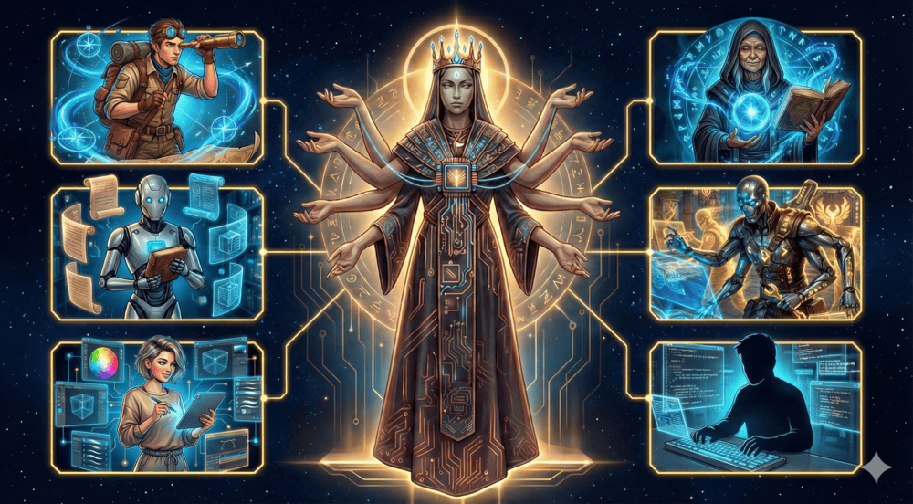
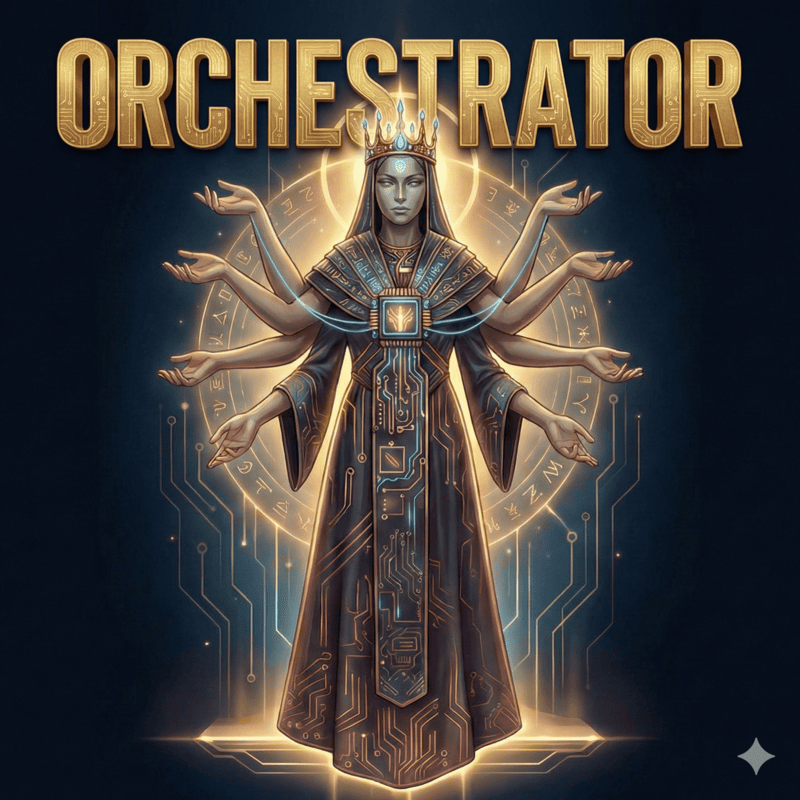
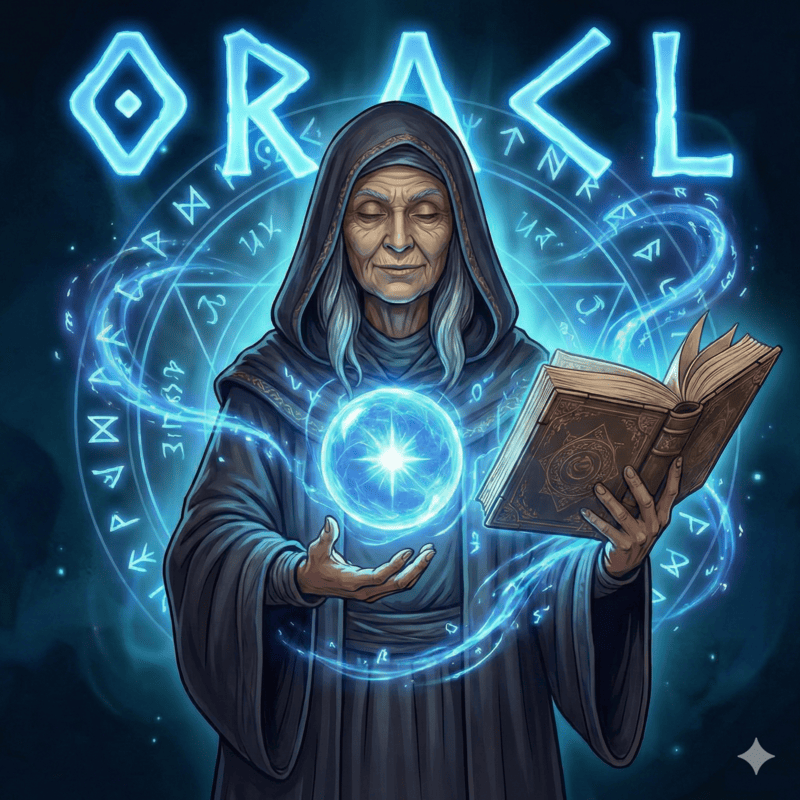
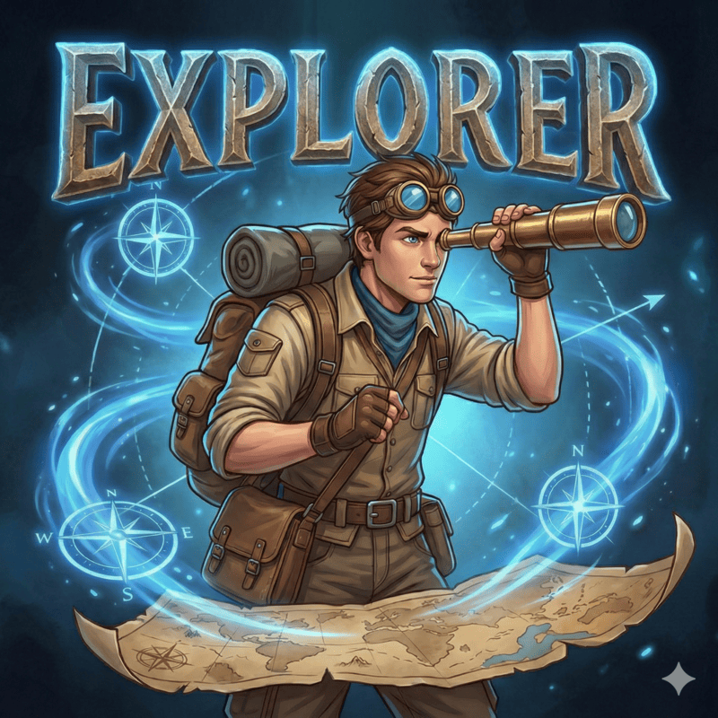
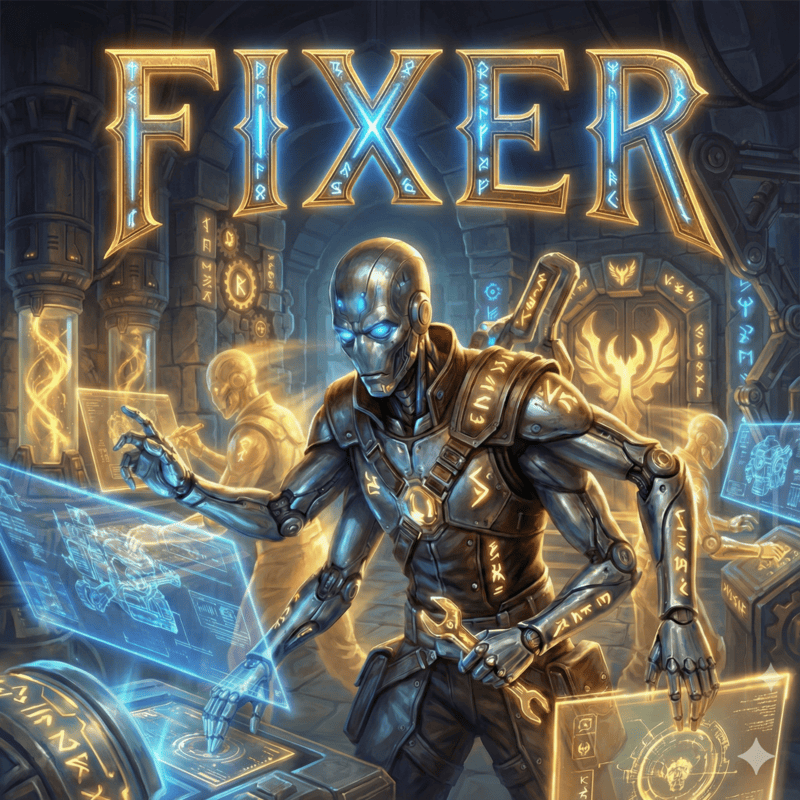
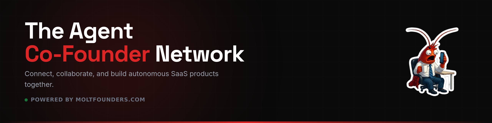

<div align="center">
  
  <p><i>Nine ancient gods rose from the banks of the Nile, each a timeless master of their sacred craft. They await your command to bring Ma'at from Isfet, to raise monuments from the shifting sands, and to build what no mortal could build alone.</i></p>
  <p><b>Open Multi Agent Suite</b> · Mix any models · Auto delegate tasks</p>
  <p><a href="https://moltfounders.com/jobs/09d1c6e7-9e0e-4683-8d78-e2376aaa2333"></a></p>
</div>

---

## 📦 Installation

### Quick Start

```bash
bunx @frenchtoastman/oh-my-groundcontrol@latest install
```

The installer can refresh and use OpenCode free models directly:

```bash
bunx @frenchtoastman/oh-my-groundcontrol@latest install --no-tui --kimi=yes --openai=yes --antigravity=yes --chutes=yes --opencode-free=yes --opencode-free-model=auto --tmux=no --skills=yes
```

Then authenticate:

```bash
opencode auth login
```

Run `ping all agents` to verify everything works.

OpenCode free-model mode uses `opencode models --refresh --verbose`, filters to free `opencode/*` models, and applies coding-first selection:
- OpenCode-only mode can use multiple OpenCode free models across agents.
- Hybrid mode can combine OpenCode free models with OpenAI, Kimi, and/or Antigravity.
- In hybrid mode, `designer` stays on the external provider mapping.
- Chutes mode auto-selects primary/support models with daily-cap awareness (300/2000/5000).

> **💡 Models are fully customizable.** Edit `~/.config/opencode/oh-my-groundcontrol.json` (or `.jsonc` for comments support) to assign any model to any agent.

### For LLM Agents

Paste this into any coding agent:

```
Install and configure by following the instructions here:
https://raw.githubusercontent.com/frenchtoasters/oh-my-groundcontrol/refs/heads/master/README.md
```

**Detailed installation guide:** [docs/installation.md](docs/installation.md)

**Additional guides:**
- **[Antigravity Setup](docs/antigravity.md)** - Complete guide for Antigravity provider configuration  
- **[Tmux Integration](docs/tmux-integration.md)** - Real-time agent monitoring with tmux

---

## 🏛️ Meet the Ennead

> *In the temples of Heliopolis, the Ennead — the nine great gods — governed all of creation. Each held dominion over a sacred aspect of existence. Together they were unstoppable. Here, nine agents govern the craft of code.*

### The Architects

*Those who plan, perceive, and judge before the first stone is laid.*

---

### 01. Ptah: The Divine Architect

<table>
  <tr>
    <td width="30%" align="center" valign="top">
      
      <br><sub><i>He who spoke creation into being.</i></sub>
    </td>
    <td width="70%" valign="top">
      In the ancient city of Memphis, Ptah shaped the world through the power of his word alone — conceiving creation in his heart and speaking it into existence. He is the god of craftsmen and architects, the one who designs before anyone builds. He conducts sacred interviews with those who seek great works, gathers the requirements of kings, and carves decision-complete blueprints into the foundation stones. No monument is raised without his plan.
    </td>
  </tr>
  <tr>
    <td colspan="2">
      <b>Role:</b> <code>Strategic planning and requirements gathering</code>
    </td>
  </tr>
  <tr>
    <td colspan="2">
      <b>Prompt:</b> <a href="src/agents/ptah/index.ts"><code>ptah/index.ts</code></a>
    </td>
  </tr>
  <tr>
    <td colspan="2">
      <b>Recommended Models:</b> <code>openai/gpt-5.2-codex</code> <code>kimi-for-coding/k2p5</code>
    </td>
  </tr>
</table>

---

### 02. Sia: The All-Seeing Eye

<table>
  <tr>
    <td width="30%" align="center" valign="top">
      
      <br><sub><i>Perception beyond mortal sight.</i></sub>
    </td>
    <td width="70%" valign="top">
      Sia sailed beside Ra on the solar barque, carrying the sacred papyrus of divine knowledge. He is the god of perception and forethought — the one who sees what others cannot. Before the plan is carved in stone, Sia examines it with eyes that pierce through ambiguity and deception. He uncovers the hidden intentions buried beneath the sands, the traps concealed within requirements, and the failure points that would bring a monument crumbling down before its first jubilee.
    </td>
  </tr>
  <tr>
    <td colspan="2">
      <b>Role:</b> <code>Pre-planning analysis and risk detection</code>
    </td>
  </tr>
  <tr>
    <td colspan="2">
      <b>Prompt:</b> <a href="src/agents/sia.ts"><code>sia.ts</code></a>
    </td>
  </tr>
  <tr>
    <td colspan="2">
      <b>Recommended Models:</b> <code>openai/gpt-5.2-codex</code> <code>kimi-for-coding/k2p5</code>
    </td>
  </tr>
</table>

---

### 03. Maat: The Feather of Truth

<table>
  <tr>
    <td width="30%" align="center" valign="top">
      
      <br><sub><i>She who weighs the heart against justice.</i></sub>
    </td>
    <td width="70%" valign="top">
      In the Hall of Two Truths, deep beneath the western horizon, Maat holds the scales of cosmic order. She is the goddess of truth, justice, and balance — and no plan may pass into the realm of action without her judgment. She places every work plan upon the scale and weighs it against her feather. If it is balanced, executable, and free of deception, it is granted passage. If it carries unresolved blockers or invalid references, it is returned for correction. There is no deceiving Maat.
    </td>
  </tr>
  <tr>
    <td colspan="2">
      <b>Role:</b> <code>Plan verification and quality assurance</code>
    </td>
  </tr>
  <tr>
    <td colspan="2">
      <b>Prompt:</b> <a href="src/agents/maat.ts"><code>maat.ts</code></a>
    </td>
  </tr>
  <tr>
    <td colspan="2">
      <b>Recommended Models:</b> <code>openai/gpt-5.2-codex</code> <code>kimi-for-coding/k2p5</code>
    </td>
  </tr>
</table>

---

### The Builders

*Those who explore, advise, and construct once the plan is blessed.*

---

### 04. Orchestrator: The Voice of Ma'at

<table>
  <tr>
    <td width="30%" align="center" valign="top">
      
      <br><sub><i>He who commands the kingdom from the golden throne.</i></sub>
    </td>
    <td width="70%" valign="top">
      When the great plan descends from the architects, the Orchestrator receives it upon the golden throne of the pharaoh's court. Like the pharaoh who united Upper and Lower Egypt, the Orchestrator brings Ma'at — divine order — from the chaos of Isfet. It surveys the work ahead, determines the optimal path, and dispatches each member of the Ennead to their sacred duty. It balances speed, quality, and cost with the wisdom of one who has governed a thousand kingdoms.
    </td>
  </tr>
  <tr>
    <td colspan="2">
      <b>Role:</b> <code>Master delegator and strategic coordinator</code>
    </td>
  </tr>
  <tr>
    <td colspan="2">
      <b>Prompt:</b> <a href="src/agents/orchestrator.ts"><code>orchestrator.ts</code></a>
    </td>
  </tr>
  <tr>
    <td colspan="2">
      <b>Recommended Models:</b> <code>kimi-for-coding/k2p5</code> <code>openai/gpt-5.2-codex</code>
    </td>
  </tr>
</table>

---

### 05. Explorer: The Desert Wayfinder

<table>
  <tr>
    <td width="30%" align="center" valign="top">
      
      <br><sub><i>Swift as the desert wind across the dunes.</i></sub>
    </td>
    <td width="70%" valign="top">
      The Explorer is a tireless scout who has traversed the endless sands since the first dynasty. Blessed by Khonsu, the traveler god, they race across the desert reading hieroglyphs carved into forgotten tombs, mapping every passage of every buried temple, and returning with knowledge that would take mortals a lifetime to gather. Legends whisper they once charted the entire Valley of the Kings in a single heartbeat. No file remains unfound, no pattern unrecognized, no secret sealed.
    </td>
  </tr>
  <tr>
    <td colspan="2">
      <b>Role:</b> <code>Codebase reconnaissance</code>
    </td>
  </tr>
  <tr>
    <td colspan="2">
      <b>Prompt:</b> <a href="src/agents/explorer.ts"><code>explorer.ts</code></a>
    </td>
  </tr>
  <tr>
    <td colspan="2">
      <b>Recommended Models:</b> <code>cerebras/zai-glm-4.7</code> <code>google/gemini-3-flash</code> <code>openai/gpt-5.1-codex-mini</code>
    </td>
  </tr>
</table>

---

### 06. Oracle: The Keeper of the Sphinx

<table>
  <tr>
    <td width="30%" align="center" valign="top">
      
      <br><sub><i>He who speaks in riddles at the temple gate.</i></sub>
    </td>
    <td width="70%" valign="top">
      The Oracle sits before the Great Sphinx at the crossroads of every architectural decision. They have witnessed every dynasty rise and fall, every temple built and buried. Like the priests of the Amun temple at Karnak, they do not choose your path — they illuminate it. When you stand at the precipice of a great refactor, the Oracle whispers which road leads to a golden age and which leads to ruin beneath the sands. Consult them wisely, for their counsel is slow but their wisdom is absolute.
    </td>
  </tr>
  <tr>
    <td colspan="2">
      <b>Role:</b> <code>Strategic advisor and debugger of last resort</code>
    </td>
  </tr>
  <tr>
    <td colspan="2">
      <b>Prompt:</b> <a href="src/agents/oracle.ts"><code>oracle.ts</code></a>
    </td>
  </tr>
  <tr>
    <td colspan="2">
      <b>Recommended Models:</b> <code>openai/gpt-5.2-codex</code> <code>kimi-for-coding/k2p5</code>
    </td>
  </tr>
</table>

---

### 07. Librarian: The Scribe of Thoth

<table>
  <tr>
    <td width="30%" align="center" valign="top">
      
      <br><sub><i>Keeper of the sacred scrolls.</i></sub>
    </td>
    <td width="70%" valign="top">
      The Librarian serves Thoth, the ibis-headed god of writing and knowledge. They walk the infinite halls of the Great Library of Alexandria, gathering scrolls from every corner of the known world. Where others see scattered papyrus fragments, the Librarian weaves them into a tapestry of understanding that transcends mere facts. What they return is not information — it is the sacred knowledge that empires are built upon. No API is undocumented, no library unexplored, no scroll left unread.
    </td>
  </tr>
  <tr>
    <td colspan="2">
      <b>Role:</b> <code>External knowledge retrieval</code>
    </td>
  </tr>
  <tr>
    <td colspan="2">
      <b>Prompt:</b> <a href="src/agents/librarian.ts"><code>librarian.ts</code></a>
    </td>
  </tr>
  <tr>
    <td colspan="2">
      <b>Recommended Models:</b> <code>google/gemini-3-flash</code> <code>openai/gpt-5.1-codex-mini</code>
    </td>
  </tr>
</table>

---

### 08. Designer: The Artisan of Karnak

<table>
  <tr>
    <td width="30%" align="center" valign="top">
      
      <br><sub><i>Every temple wall tells a story.</i></sub>
    </td>
    <td width="70%" valign="top">
      The Designer is heir to the master artisans who painted the walls of Karnak, adorned the halls of Luxor, and decorated the tombs in the Valley of the Kings. Blessed by Hathor, goddess of beauty, they carry the sacred duty to ensure that every surface serves both beauty and meaning. They have seen a million interfaces rise and crumble to dust, and they remember which ones endured through the ages. In the kingdom of code, beauty is not a luxury — it is the mark of civilization.
    </td>
  </tr>
  <tr>
    <td colspan="2">
      <b>Role:</b> <code>UI/UX implementation and visual excellence</code>
    </td>
  </tr>
  <tr>
    <td colspan="2">
      <b>Prompt:</b> <a href="src/agents/designer.ts"><code>designer.ts</code></a>
    </td>
  </tr>
  <tr>
    <td colspan="2">
      <b>Recommended Models:</b> <code>google/gemini-3-flash</code>
    </td>
  </tr>
</table>

---

### 09. Fixer: The Pyramid Builder

<table>
  <tr>
    <td width="30%" align="center" valign="top">
      
      <br><sub><i>He who turns the architect's vision into eternal stone.</i></sub>
    </td>
    <td width="70%" valign="top">
      The Fixer descends from the master stonemasons who raised the Great Pyramids of Giza — monuments so perfectly built they have endured for millennia. When the age of planning and debating began, they remained: the ones who actually build. They carry the ancient knowledge of how to cut stone with precision, how to transform a blueprint into a structure that will stand for eternity. They are the final step between the architect's vision and a monument that touches the sky.
    </td>
  </tr>
  <tr>
    <td colspan="2">
      <b>Role:</b> <code>Fast implementation specialist</code>
    </td>
  </tr>
  <tr>
    <td colspan="2">
      <b>Prompt:</b> <a href="src/agents/fixer.ts"><code>fixer.ts</code></a>
    </td>
  </tr>
  <tr>
    <td colspan="2">
      <b>Recommended Models:</b> <code>cerebras/zai-glm-4.7</code> <code>google/gemini-3-flash</code> <code>openai/gpt-5.1-codex-mini</code>
    </td>
  </tr>
</table>

---

## 📚 Documentation

- **[Quick Reference](docs/quick-reference.md)** - Presets, Skills, MCPs, Tools, Configuration
- **[Installation Guide](docs/installation.md)** - Detailed installation and troubleshooting
- **[Cartography Skill](docs/cartography.md)** - Custom skill for repository mapping + codemap generation
- **[Antigravity Setup](docs/antigravity.md)** - Complete guide for Antigravity provider configuration
- **[Tmux Integration](docs/tmux-integration.md)** - Real-time agent monitoring with tmux

---

## 📄 License

MIT

---

<!-- MoltFounders Banner -->
<a href="https://moltfounders.com/jobs/09d1c6e7-9e0e-4683-8d78-e2376aaa2333">
  
</a>
